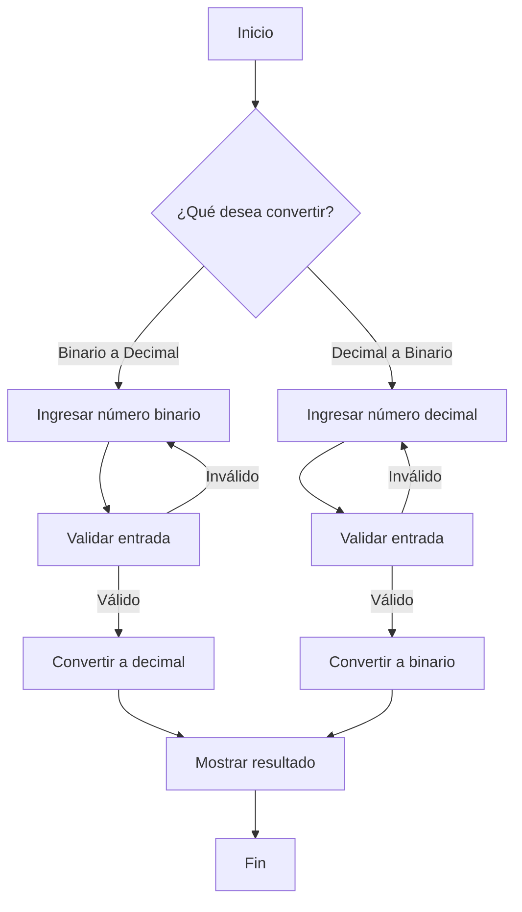

# Conversor Binario-Decimal

## Descripción

Este programa interactivo permite convertir números entre los sistemas **binario** y **decimal**. El usuario puede elegir la dirección de la conversión y el programa valida las entradas para asegurar resultados correctos.

---

## Menú Principal

Al iniciar, el usuario verá el siguiente menú:

```
=========================================================
🔃 Conversor de Binario a Decimal / Decimal a Binario 🔃
=========================================================
Por favor, escoja la opcion que desea: 
(1) Conversor de Binario a Decimal
(2) Conversor de Decimal a Binario
```

---

## Conversión de Binario a Decimal

### Proceso

1. El usuario ingresa un número binario (solo 0 y 1).
2. El programa valida la entrada.
3. Se calcula el valor decimal sumando las potencias de 2 correspondientes a cada bit.

### Ejemplo

Supongamos que el usuario ingresa `1011`:

```
Posición:    3   2   1   0
Bit:         1   0   1   1
Potencia:    2^3 2^2 2^1 2^0
Resultado:   8 + 0 + 2 + 1 = 11
```

**Salida esperada:**
```
El numero es: 11
```

---

## Conversión de Decimal a Binario

### Proceso

1. El usuario ingresa un número decimal.
2. El programa valida la entrada.
3. Se divide el número entre 2 sucesivamente, guardando el residuo en cada paso.
4. El resultado binario es la secuencia de residuos leída de abajo hacia arriba.

### Ejemplo

Supongamos que el usuario ingresa `13`:

```
13 / 2 = 6, residuo 1
 6 / 2 = 3, residuo 0
 3 / 2 = 1, residuo 1
 1 / 2 = 0, residuo 1
```

Leyendo los residuos de abajo hacia arriba: **1101**

**Salida esperada:**
```
1101
```

---

## Diagrama de Flujo



---

## Validaciones

- **Binario:** Solo acepta números compuestos por 0 y 1.
- **Decimal:** Solo acepta números enteros positivos.

---

## Ejecución

Para ejecutar el programa, simplemente corre el archivo en tu terminal:

```bash
python conversor.py
```
